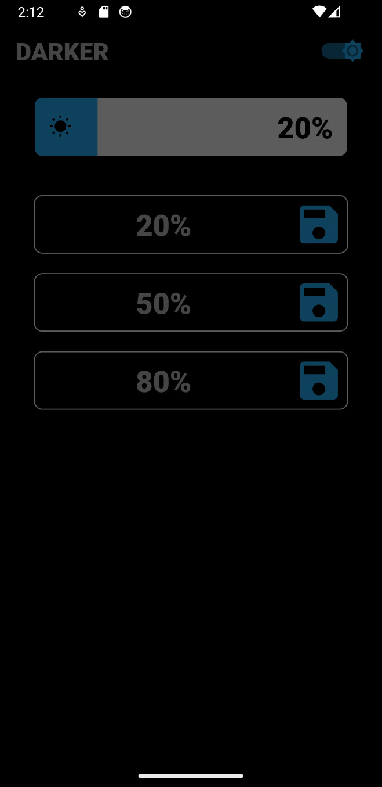

# Darker

    

#### Overview

> [!WARNING]  
> This application is no longer maintained and may not work properly on new devices. A new version might be released in the future.

This application is designed to darken the screen below the system minimum.

#### Features
- **Brightness selection**:
  - **Activation**: Use the toggle to activate/deactivate the brightness filter
  - **Adjust brightness**: Use the slider to precisely change the brightness
  - **Load**: Set the brightness to the saved value
  - **Save**: Save the current brightness, up to 3 values can be saved at the same time

- **Notification**:
  - **Adjust brightness**: Use the buttons to change the brightness (-5% / +5%)
  - **Load**: Set the brightness to the saved value

- **Quick Tile**:
  - **Activate**: Use the quick tile to activate/deactivate the brightness filter
  - **Access app**: Long press the quick tile to launch the application UI

Darker is designed to reduce the screen brightness below the system minimum to use the device in a dark environnement. Modern Android OS implement a similar feature called "Extra dim".
